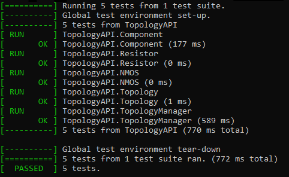

<!-- e948dab61d9a411dfe273eb6da65f723 -->

# TopologyAPI
A library that provides an API to load topologies from a JSON file to memory,
 query them from memory or save them back to a JSON file.

# Documentations
[TopologyAPI documentations can be found here!](docs.md)

## Project Information
- **Language:** C++
- **Build System:** CMake
- **Package Management:** using GIT submodules
- **Testing Framework:** [GoogleTest](https://github.com/google/googletest)
- **JSON Parsing Library** [JSON for Modern C++](https://github.com/nlohmann/json) \
**Note:** you have to use **git clone --recursive** in order to pull the dependencies

## Project Structure
- **TopologyAPI:** The library implements the API to handle topologies.
- **TopologyAPITest:** The unit tests for TopologyAPI library.

## Tests

